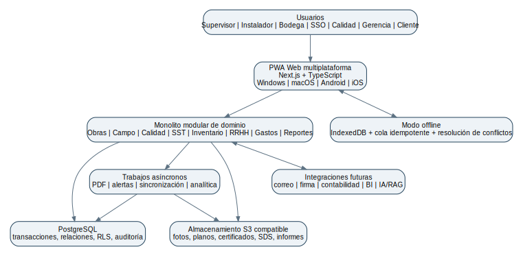

# ANKLO-OS - Bosquejo funcional y arquitectura

## 1. Visión del producto

ANKLO-OS será un ERP especializado en trabajo de campo para instalación de anclajes. Debe responder tres preguntas con evidencia:

1. **¿Qué debía hacerse?** plano, especificación, sistema y revisión aprobados.
2. **¿Qué se hizo realmente?** quién, dónde, cómo, cuándo, con qué lote/herramienta y bajo qué condiciones.
3. **¿Cuál fue el resultado?** conformidad, prueba, costo, productividad, incidencias y cierre.

No será un clon de Odoo. Adoptará principios útiles: módulos desacoplados, modelos relacionados, grupos/permisos, reglas por registro, actividades, documentos, estados, trazabilidad de movimientos e informes [ODOO-01, ODOO-02].



## 2. Decisión tecnológica

### 2.1 Stack recomendado

| Capa | Elección | Razón |
|---|---|---|
| Lenguaje | TypeScript | Un lenguaje para frontend, backend, validación y pruebas; favorable para vibecoding y revisión humana. |
| Web/PWA | Next.js App Router | Aplicación web moderna, formularios, renderizado y guía oficial de PWA [NEXT-01, NEXT-02]. |
| Base de datos | PostgreSQL | Integridad relacional, transacciones, consultas analíticas, JSONB para extensiones controladas [PG-01]. |
| ORM | Prisma, versión estable fijada | Esquema legible, tipos y migraciones accesibles para un equipo pequeño; SQL directo para reportes complejos. |
| Validación | Zod o equivalente | Un mismo contrato de datos en cliente y servidor. |
| Archivos | S3 compatible | Escala, versionado y separación entre metadatos y binarios. MinIO en desarrollo. |
| Colas | Redis + BullMQ en fase 2 | PDF, alertas, OCR opcional, sincronización y tareas largas. |
| PDF | HTML/CSS + Chromium | Plantillas controlables para partes, inventarios, certificados y dossiers. |
| Despliegue | Docker | Reproducibilidad y portabilidad entre nube/servidor propio. |
| Observabilidad | logs estructurados + métricas + trazas | Diagnóstico y auditoría de operaciones críticas. |

### 2.2 Arquitectura: monolito modular

Un único despliegue inicial, pero separado por dominios: identidad, obras, campo, calidad, SST, inventario, RRHH, gastos, documentos y reportes. Cada módulo posee servicios, reglas y tablas claramente delimitadas. Se extrae un servicio solo cuando exista una razón medible: carga, equipo independiente, aislamiento de seguridad o integración.

### 2.3 Repositorio

```text
anklo-os/
  apps/
    web/                 # Next.js PWA
    worker/              # tareas asíncronas (fase 2)
  packages/
    db/                  # Prisma, migraciones, seeds
    domain/              # reglas y servicios de negocio
    contracts/           # esquemas Zod y tipos compartidos
    ui/                  # componentes
    reports/             # plantillas PDF
    config/              # ESLint, TS, pruebas
  docs/
    adr/                  # decisiones de arquitectura
    processes/            # BPMN/diagramas
    api/                  # contratos
```

## 3. Principios de diseño

- **Offline-first en campo:** guardar localmente y sincronizar sin duplicar.
- **Trazabilidad por eventos:** no sobrescribir silenciosamente estados críticos.
- **Datos maestros controlados:** producto, diámetro, grado, método y condición se seleccionan de catálogos aprobados.
- **Configuración por producto/proyecto:** no codificar tiempos o ciclos universales.
- **Segregación de funciones:** quien ejecuta no necesariamente aprueba.
- **Privacidad desde el diseño:** minimización, retención, cifrado, acceso por necesidad [EC-05, EC-06].
- **Auditabilidad:** usuario, fecha, origen, antes/después y motivo.
- **IA subordinada:** propone; una persona competente aprueba.
- **Decisiones sobre personas y seguridad:** se prohíben decisiones exclusivamente automatizadas sobre conformidad estructural, seguridad, disciplina, aptitud laboral, pagos o derechos de trabajadores.

## 4. Perfiles y permisos

| Rol | Alcance típico |
|---|---|
| Administrador plataforma | configuración técnica global, no operación diaria. |
| Administrador empresa | usuarios, obras, catálogos y políticas de su organización. |
| Gerencia | dashboards, costos, aprobaciones y reportes consolidados. |
| Jefe de proyecto/residente | alcance de obra, planificación, RFI, aprobaciones operativas. |
| Supervisor | cuadrilla, registros de campo, inventario asignado, partes, NCR inicial. |
| Instalador | tareas asignadas, checklist y evidencia limitada. |
| Calidad | ITP, inspecciones, ensayos, NCR/CAPA y cierre. |
| SSO | riesgos, permisos, inducciones, incidentes y certificados. |
| Bodega | recepción, entrega, devolución, transferencias, conteos. |
| RRHH/finanzas | asistencia, viáticos y validación laboral/económica. |
| Cliente/fiscalizador | portal de lectura/aprobación según contrato. |

Permisos en tres niveles: acción sobre módulo, alcance por organización/obra y condición del registro. Ejemplo: un supervisor puede editar un anclaje de su obra mientras esté en borrador, pero no después de aprobado; una corrección genera una revisión.

## 5. Módulos funcionales

### 5.1 Núcleo y administración

Organizaciones, sucursales, obras, frentes, ubicaciones, usuarios, roles, equipos de trabajo, catálogos, numeraciones, monedas, unidades, zonas horarias, auditoría y configuración. Incluye un servicio transversal de notificaciones y escalamiento con gravedad, evento de origen, destinatario, canal, reconocimiento, plazo y escalamiento, sin imponer un canal o proveedor concreto.

### 5.2 CRM/cliente y contratos

Clientes, contactos, oportunidades básicas, contrato, alcance, hitos, responsables, requisitos de entrega, portal y correspondencia. No es prioridad del MVP, pero la estructura evita duplicar clientes por obra.

### 5.3 Documentos y planos

- Versionado de plano y estado: borrador, en revisión, aprobado, obsoleto.
- Vínculo de cada anclaje con revisión de plano/RFI.
- Submittals, MPII, SDS, ESR/ETA, procedimientos e ITP.
- Check-out/bloqueo opcional y distribución controlada.
- Alertas cuando una revisión nueva afecta trabajo pendiente.

### 5.4 Obras y planificación

WBS, actividades, lookahead, restricciones, compromisos semanales, PPC, calendario, frentes, bloqueos y responsables. Plantillas por tipo de proyecto.

### 5.5 Servicio de campo / anclajes

- Orden de trabajo y lote de ejecución.
- Registro individual o por lote homogéneo, con posibilidad de “explotar” a IDs individuales.
- Replanteo, escaneo, perforación, limpieza, adhesivo, inserción, curado, montaje e inspección.
- Fotos con fecha, usuario y relación al paso; GPS como evidencia complementaria.
- Temporizadores de curado calculados desde una tabla aprobada versionada.
- Bloqueos si faltan campos críticos.
- QR para identificar anclaje, lote o ubicación.

### 5.6 Calidad

ITP, puntos Hold/Witness, inspecciones, ensayos, equipos/calibración, NCR, disposición, CAPA, auditorías, muestreo aprobado, firmas y dossier de calidad.

### 5.7 SST

Matriz de peligros, ATS/IPER, permisos, inducciones, charlas, inspecciones, EPP, observaciones, casi incidentes, incidentes, acciones, emergencias y registro de incidencias exigido por MDT-2025-122.

### 5.8 Inventario y lotes

Diseño inspirado en el principio de movimientos de Odoo: el saldo se deriva de recepciones, transferencias, entregas, consumo, devolución, merma y ajuste; no se edita una cifra sin movimiento.

- Productos, unidades, lotes, vencimientos y ubicaciones.
- FEFO para adhesivos.
- Reserva por obra/orden.
- Consumo vinculado a anclajes.
- Cuarentena y disposición.
- Conteos cíclicos.
- Alertas de sobreconsumo con tolerancia basada en datos.

### 5.9 Herramientas, activos y mantenimiento

Activo/serie, custodio, ubicación, entrada/salida, condición, accesorios, inspecciones, calibraciones, horas/ciclos, mantenimiento preventivo/correctivo y bloqueo de uso.

### 5.10 Vehículos y logística

Checklist preuso, conductor, ruta, kilometraje, combustible, mantenimiento, carga, pasajeros autorizados, incidentes y documentos.

### 5.11 Personal, cuadrillas y competencia

Ficha laboral mínima, contacto, rol, asignaciones, matriz de competencia, inducciones, certificados y vencimientos. Datos sensibles separados y accesibles solo a roles autorizados.

### 5.12 Asistencia y horas

Entrada/salida, pausas, ubicación/obra, actividad, horas aprobadas y correcciones auditadas. Motor de reglas parametrizable y versionado; RRHH aprueba el cálculo legal.

### 5.13 Gastos y viáticos

Solicitud, anticipo, gasto, comprobante, OCR opcional, centro de costo, política, aprobación, devolución y cierre. No se borra un gasto aprobado; se revierte con registro.

### 5.14 Compras y proveedores

Solicitud, cotización, aprobación, orden, recepción, factura y evaluación. Catálogo de productos aprobados separado del catálogo comercial. Cada proveedor se clasifica según su papel en el tratamiento de datos y, cuando actúe como encargado, se aplican los requisitos contractuales correspondientes.

### 5.15 Reportes y BI

Partes diarios, informes semanales, dossier, inventario de entrada/salida, certificados por vencer, costos, productividad, FPY, NCR, consumo, PPC y seguridad. Exportación CSV/XLSX y conexión de solo lectura a BI en fase posterior.

### 5.16 IA y conocimiento

- RAG exclusivamente sobre documentos aprobados y versionados.
- Respuestas con cita a documento/página/revisión.
- Borrador de informe a partir de datos estructurados.
- Detección de datos incoherentes: curado anterior a inserción, lote vencido, herramienta sin calibración, profundidad fuera de rango configurado.
- Pronóstico de consumo y duración con intervalos de incertidumbre.
- Prohibido generar valores de instalación no presentes en fuente aprobada.
- La interacción con IA y la decisión humana de revisión se registran por separado y permanecen relacionadas, sin sobrescribir la solicitud, las fuentes, la salida, el revisor, la decisión ni su motivo.

## 6. Modelo de datos de alto nivel

### 6.1 Entidades centrales

```text
Organization 1---n Project 1---n WorkFront 1---n Anchor
Project 1---n DrawingRevision
Anchor n---1 AnchorSystemVersion
Anchor n---1 InstallationBatch
InstallationBatch n---1 AdhesiveLot
Anchor 1---n Inspection
Anchor 1---n TestResult
Anchor 1---n EvidenceFile
Anchor 0---n Nonconformity
Worker n---n CrewAssignment n---1 Project
Asset 1---n AssetMovement
StockItem/Lot 1---n StockMovement
Expense n---1 Project / Worker / CostCenter
Certificate n---1 Worker or Asset
AIInteraction 1---n HumanReviewDecision
```

### 6.2 Tablas críticas

**Anchor**: id, organization_id, project_id, drawing_revision_id, location, system_version_id, diameter, required_embedment, actual_embedment, status, installed_at, cure_release_at, installed_by, supervised_by, version.

**AnchorSystemVersion**: producto, aprobación, MPII, rango de temperatura, método de perforación, condición de orificio, tabla de curado en estructura versionada, vigencia y aprobador. No se modifica retroactivamente; se crea nueva versión.

**AuditEvent**: actor, acción, entidad, id, timestamp, origen, before_json, after_json, razón, correlation_id. Es append-only para las interfaces ordinarias; toda corrección genera un nuevo evento o una revisión enlazada y nunca modifica silenciosamente el evento anterior.

**AIInteraction / HumanReviewDecision**: solicitud, fuentes, salida y contexto de la interacción; revisor, decisión, motivo y timestamp de la revisión humana, como registros separados y relacionados.

**StockMovement**: producto/lote, origen, destino, cantidad, unidad, tipo, referencia, responsable, fecha y costo.

### 6.3 Multiempresa y seguridad en datos

Toda tabla de negocio lleva `organization_id`. Las consultas se filtran en servicio y, donde sea viable, mediante Row Level Security de PostgreSQL. Los IDs públicos son UUID/ULID; los números de documento son secuencias por empresa/obra.

Los archivos se aíslan por organización mediante autorización en el servidor, namespaces o prefijos separados, claves no predecibles y buckets no públicos. El acceso utiliza URLs firmadas de corta duración y pruebas automatizadas verifican que una organización no pueda acceder a archivos de otra.

## 7. Flujos de estado

### 7.1 Anclaje

`BORRADOR -> LIBERADO -> PERFORADO -> LIMPIO -> INYECTADO -> CURANDO -> PENDIENTE_INSPECCION -> CONFORME`

Desviaciones: `BLOQUEADO`, `NCR_ABIERTA`, `REPARACION`, `RECHAZADO`, `ANULADO`. El sistema verifica transiciones; no permite marcar conforme desde borrador.

### 7.2 No conformidad

`ABIERTA -> CONTENCION -> ANALISIS -> DISPOSICION_APROBADA -> ACCION_EJECUTADA -> VERIFICADA -> CERRADA`.

### 7.3 Inventario

`SOLICITADO -> APROBADO -> RESERVADO -> DESPACHADO -> RECIBIDO_EN_OBRA -> CONSUMIDO/DEVUELTO -> CONCILIADO`.

## 8. Modo offline y sincronización

### 8.1 Qué funciona offline

Lista de tareas asignadas, planos ligeros previamente descargados, catálogos necesarios, formularios, fotos en cola, firmas locales y consulta de MPII cacheada. Operaciones financieras/administrativas críticas pueden requerir conexión.

### 8.2 Estrategia

- IndexedDB para datos locales cifrados cuando la plataforma lo permita.
- Los catálogos disponibles offline son de solo lectura.
- Las operaciones críticas se expresan como comandos con `client_operation_id` idempotente.
- Sincronización por eventos; el servidor confirma o rechaza con motivo.
- Los registros aprobados no se sobrescriben; todo cambio posterior genera una revisión o evento relacionado.
- Los conflictos críticos requieren resolución humana. Las notas y evidencias pueden añadirse o fusionarse de forma controlada.
- El inventario se modifica exclusivamente mediante movimientos, también durante la sincronización.
- Indicador visible de estado: local, en cola, sincronizado, conflicto.
- Nunca afirmar “guardado” si solo está en memoria.

## 9. Seguridad y privacidad

- MFA obligatorio para administradores y aprobadores críticos, con preferencia por WebAuthn, passkeys o llaves de seguridad; TOTP es alternativa y SMS no debe ser la opción principal.
- Contraseñas mediante proveedor seguro/OIDC; no diseñar criptografía propia.
- TLS, cifrado de almacenamiento y capacidades mínimas de seguridad HTTP, incluidas cabeceras y controles seguros acordes con el despliegue.
- Secretos fuera del repositorio, administrados mediante un gestor seguro con control de acceso y rotación.
- Acceso mínimo, sesiones revocables y registro de exportaciones.
- URLs firmadas de corta duración para archivos.
- Todo despliegue productivo que permita cargas aplica controles antimalware antes de liberar o procesar archivos, con cuarentena y tratamiento seguro de fallos.
- Retención y eliminación por categoría; respaldo no equivale a archivo eterno.
- La privacidad sigue un flujo verificable: inventario de actividades de tratamiento, clasificación de datos, aplicación documentada del modelo de tratamiento a gran escala cuando corresponda, evaluación de impacto y determinación de DPD únicamente si se configura el supuesto legal.
- Fotos/GPS solo con finalidad definida; evitar vigilancia innecesaria.
- La respuesta a incidentes de seguridad y vulneraciones de datos comprende detección, contención, evaluación, preservación de registros, escalamiento, recuperación y análisis de las notificaciones que correspondan según aplicabilidad y plazos legales.

## 10. Informes PDF

Plantillas versionadas con número, QR de verificación, zona de firmas y hash/revisión. Tipos iniciales:

1. Parte diario.
2. Acta de entrada/salida de equipo.
3. Registro de instalación por lote/anclaje.
4. Informe de prueba.
5. NCR/CAPA.
6. Liquidación de gastos.
7. Resumen semanal.
8. Dossier de cierre.

El PDF se genera desde datos ya aprobados; no permite editar el contenido final sin crear una revisión.

Los archivos fotográficos originales y los metadatos de evidencia disponibles se preservan; toda transformación produce un derivado vinculado y un registro de cambios, sin sobrescribir el original. El hash permite comprobar la integridad o coincidencia del archivo, pero no demuestra por sí solo lugar, fecha, autoría material ni admisibilidad jurídica.

## 11. KPIs del sistema

- Anclajes conformes, en proceso, bloqueados y NCR.
- Productividad normalizada por tipo/profundidad/condición.
- FPY, retrabajo y tiempo de cierre de NCR.
- Consumo real vs teórico ajustado.
- Costo por anclaje conforme.
- Cumplimiento de trazabilidad.
- PPC y razones de no cumplimiento.
- Certificados/calibraciones por vencer.
- Observaciones de SST vencidas y acciones cerradas.
- Exactitud de inventario y pérdidas.

## 12. MVP y roadmap

### Fase 0 - 2 a 4 semanas: descubrimiento

BPMN del proceso actual, catálogo real de productos, diccionario de datos, RACI, prototipo de formularios y criterios de aceptación. Resultado: backlog priorizado y prueba con usuarios.

### MVP - 8 a 12 semanas orientativas

- Autenticación, empresa, obra y roles.
- Personal/cuadrilla básica.
- Documentos y revisión de plano.
- Orden/lote/anclaje, checklist y fotos.
- Productos/lotes y consumo.
- Curado y alertas.
- NCR básica.
- Parte diario e inventario de entrada/salida.
- PWA offline para formularios esenciales.

### Versión 1

Calidad completa, ensayos, activos, certificados, asistencia, viáticos, reportes y dashboards.

### Versión 2

Compras, mantenimiento, portal de cliente, BI, integraciones y RAG.

## 13. Estrategia de vibecoding segura

1. Mantener especificaciones y ADR antes del código.
2. Pedir cambios pequeños y revisables; una migración por vez.
3. Usar tipos estrictos, validación servidor y pruebas de reglas críticas.
4. Nunca aceptar código de IA que omita autorización, transacciones o manejo de errores.
5. Generar datos ficticios; no usar datos reales de trabajadores en desarrollo.
6. Revisar automáticamente dependencias, licencias y vulnerabilidades dentro del proceso de integración, sin imponer una herramienta específica.
7. CI obligatoria: formato, lint, tipos, pruebas, migración y build.
8. Definir continuidad operacional, RTO y RPO mediante análisis y ejecutar pruebas periódicas de restauración; sus valores numéricos permanecen como decisión pendiente.

### 13.1 Pruebas prioritarias

- Un usuario no ve otra empresa/obra.
- No se puede cerrar un anclaje sin campos críticos.
- El cálculo de curado usa la versión correcta y no cambia registros históricos.
- La misma operación offline no se duplica.
- El flujo E2E offline-online conserva operaciones pendientes y resuelve rechazos de forma visible.
- La concurrencia de cuadrillas, los duplicados y los conflictos no sobrescriben registros aprobados.
- La carga y sincronización de fotografías conserva originales, metadatos y estado de cola.
- El almacenamiento local lleno produce un fallo controlado sin declarar falsamente que la información fue guardada.
- Una actualización con operaciones pendientes no pierde ni duplica comandos.
- Un movimiento de inventario conserva balance y lote.
- Una corrección aprobada queda auditada.
- Un PDF coincide con la revisión de datos.
- El aislamiento multiempresa impide el acceso cruzado a datos y archivos.
- La restauración recupera datos y archivos dentro de los objetivos definidos.

## 14. Decisiones pendientes antes de programar

- Productos y fabricantes reales de ANKLO.
- Flujo de aprobación con residente/fiscalizador.
- Nivel de registro: individual, lote o híbrido por tipo de obra.
- Política de fotos, GPS, firma y retención.
- Reglas laborales revisadas por RRHH/abogado.
- Infraestructura: nube, región, dominio, correo y respaldo.
- Alcance multiempresa y portal cliente.
- Dispositivo principal y escenarios reales sin señal.
- Valores numéricos de RTO y RPO según el análisis de continuidad operacional.

Las siguientes materias permanecen expresamente como decisiones futuras y no forman parte del alcance obligatorio del MVP.

### Evidencia y gobernanza documental

- Preservación formal de expedientes.
- Matriz de firma por tipo documental para determinar cuándo utilizar firma electrónica.
- Registro normativo manual y versionado.
- Hash-chain, almacenamiento WORM o sellado temporal externo según riesgo y necesidad, sin atribuirles por sí solos verdad o admisibilidad jurídica.

### Plataforma e integraciones

- API externa versionada y autorizada por alcance.
- Infraestructura reproducible o como código.
- Correlación avanzada de logs o SIEM según crecimiento y riesgo.

### Dispositivos y aplicación de campo

- Política de dispositivos corporativos o BYOD.
- Prueba de concepto para decidir entre PWA pura y wrapper móvil.

## 15. Criterios de éxito

El MVP es exitoso cuando reduce tiempo de informe, eleva completitud de trazabilidad, disminuye NCR/retrabajo, concilia inventario y funciona en obra sin depender de conectividad continua. No se mide por cantidad de módulos ni líneas de código.

## Referencias verificables principales

> Las normas completas suelen estar protegidas por derechos de autor. Este manual resume su función y remite a la edición aplicable; no reproduce su texto. Antes de una obra se debe confirmar la edición contractual y adquirir o consultar legalmente los documentos necesarios.

- **[EC-01]** Ministerio del Trabajo del Ecuador. *Decreto Ejecutivo Nro. 255 - Reglamento de Seguridad y Salud en el Trabajo* (2024). https://www.trabajo.gob.ec/wp-content/uploads/2024/01/DECRETO-EJECUTIVO-255-REGLAMENTO-DE-SEGURIDAD-Y-SALUD-DE-LOS-TRABAJADORES.pdf
- **[EC-02]** Ministerio del Trabajo del Ecuador. *Acuerdo Ministerial Nro. MDT-2025-122 - Reglamento de seguridad en el trabajo y prevención de riesgos laborales para la construcción y obras públicas y privadas* (2025). https://www.trabajo.gob.ec/wp-content/uploads/2025/09/Acuerdo-Ministerial-Nro.-MDT-2025-122-signed.pdf
- **[EC-03]** Ministerio del Trabajo del Ecuador. *Norma Técnica de Seguridad e Higiene del Trabajo - Anexo 3* (2024). https://www.trabajo.gob.ec/wp-content/uploads/2024/11/Anexo-3_Norma-Tecnica-de-Seguridad-e-Higiene-del-Trabajo-signed-signed-signed-signed.pdf
- **[EC-04]** Ministerio de Infraestructura y Transporte. *Norma Ecuatoriana de la Construcción (portal oficial)*. https://www.mit.gob.ec/norma-ecuatoriana-de-la-construccion/
- **[EC-05]** Superintendencia de Protección de Datos Personales. *Guía de protección de datos desde el diseño y por defecto* (2025). https://spdp.gob.ec/wp-content/uploads/2025/10/40.02-Guia-de-Proteccion-de-Datos-desde-el-Diseno-y-por-Defecto.pdf
- **[EC-06]** Ministerio de Telecomunicaciones. *Ley y Reglamento de la Ley Orgánica de Protección de Datos Personales*. https://www.telecomunicaciones.gob.ec/ley-y-reglamento-de-la-ley-de-proteccion-de-datos-personales/
- **[ACI-01]** American Concrete Institute. *ACI CODE-318-25: Building Code for Structural Concrete*. https://www.concrete.org/store/productdetail.aspx?Format=PROTECTED_PDF&ItemID=318U25&Language=English&Units=US_Units
- **[ACI-02]** American Concrete Institute. *ACI CODE-355.4-24: Post-Installed Adhesive Anchors in Concrete - Qualification Requirements and Commentary*. https://www.concrete.org/Portals/0/Files/PDF/Previews/355.4-24_preview.pdf
- **[ACI-03]** American Concrete Institute. *Anchorage to Concrete - educational webinar*. https://www.concrete.org/portals/0/files/pdf/webinars/ws_F23_Matthew%20Senecal.pdf
- **[ASTM-01]** ASTM International. *ASTM E488/E488M-22 - Standard Test Methods for Strength of Anchors in Concrete Elements*. https://store.astm.org/e0488_e0488m-22.html
- **[ASTM-02]** ASTM International. *ASTM E1512-01(2023) - Standard Test Methods for Testing Bond Performance of Bonded Anchors*. https://www.astm.org/membership-participation/technical-committees/committee-e06/subcommittee-e06/jurisdiction-e0613
- **[ASTM-03]** ASTM International. *ASTM E3121/E3121M - Field Testing of Anchors in Concrete or Masonry*. https://store.astm.org/e3121_e3121m-17.html
- **[ICC-01]** ICC Evaluation Service. *AC308 - Acceptance Criteria for Post-Installed Adhesive Anchors in Concrete Elements* (context and revisions). https://cdn-v2.icc-es.org/wp-content/uploads/2018/09/AC308Revisions.pdf
- **[ICC-02]** ICC Evaluation Service. *ESR-3814 - Hilti HIT-RE 500 V3*. https://icc-es.org/wp-content/uploads/report-directory/ESR-3814.pdf
- **[MFG-01]** Hilti. *Anchor Installation / SafeSet*. https://www.hilti.com/content/hilti/W1/US/en/business/business/productivity/anchor-installation.html
- **[MFG-02]** Hilti. *Adhesive Anchor Volume Calculator*. https://www.hilti.com/content/hilti/W1/US/en/business/business/engineering/anchors/volume-calculator.html
- **[MFG-03]** Simpson Strong-Tie. *Adhesive Anchoring Installation Instructions*. https://www.strongtie.com/products/anchoring-systems/technical-notes/anchoring-adhesives/installation-instructions
- **[MFG-04]** Simpson Strong-Tie. *3G Adhesive Products and Applications*. https://www.strongtie.com/products/anchoring-systems/3g-adhesives-family
- **[ISO-01]** ISO. *ISO 9001:2015 - Quality management systems*. https://www.iso.org/standard/62085.html
- **[ISO-02]** ISO. *ISO 45001:2018 - Occupational health and safety management systems*. https://www.iso.org/standard/63787.html
- **[ISO-03]** ISO. *ISO 31000:2018 - Risk management - Guidelines*. https://www.iso.org/standard/65694.html
- **[OSHA-01]** OSHA. *29 CFR 1926.1153 - Respirable crystalline silica*. https://www.osha.gov/laws-regs/regulations/standardnumber/1926/1926.1153
- **[PAPER-01]** González et al. *Influence of construction conditions on strength of post-installed bonded anchors*. Construction and Building Materials (2018). https://www.sciencedirect.com/science/article/abs/pii/S0950061817325497
- **[PAPER-02]** Müsevitoğlu et al. *Experimental and analytical investigation of chemical anchors embedded in concrete under tensile effect*. Measurement (2020). https://www.sciencedirect.com/science/article/abs/pii/S026322412030227X
- **[PAPER-03]** Epackachi et al. *Behavior of adhesive bonded anchors under tension and shear loads*. Engineering Structures (2015). https://www.sciencedirect.com/science/article/abs/pii/S0143974X15300420
- **[ODOO-01]** Odoo. *Odoo 19 developer documentation - modules*. https://www.odoo.com/documentation/19.0/developer/reference/backend/module.html
- **[ODOO-02]** Odoo. *Security in Odoo - access rights and record rules*. https://www.odoo.com/documentation/19.0/developer/reference/backend/security.html
- **[NEXT-01]** Next.js. *App Router documentation*. https://nextjs.org/docs/app
- **[NEXT-02]** Next.js. *Progressive Web Applications guide*. https://nextjs.org/docs/app/guides/progressive-web-apps
- **[PG-01]** PostgreSQL. *JSON types*. https://www.postgresql.org/docs/current/datatype-json.html
