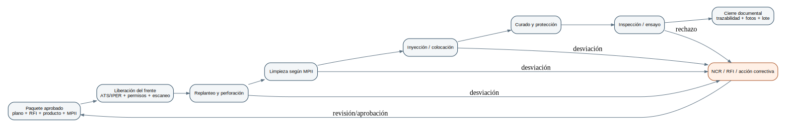

# Manual Maestro de Supervisión e Instalación de Anclajes - ANKLO

**Versión:** 1.1  
**Fecha de corte normativo y técnico:** 10 de julio de 2026  
**Usuario principal:** Israel - supervisor en formación, ingeniero biotecnólogo  
**Ámbito:** instalación de anclajes postinstalados en hormigón y, cuando el sistema esté expresamente aprobado, en mampostería.

> **Regla central:** ninguna tabla genérica de este manual reemplaza el plano aprobado, la especificación del proyecto, el reporte de evaluación del producto ni las instrucciones de instalación impresas del fabricante (MPII). Cuando exista una contradicción, se detiene el trabajo y se emite una consulta técnica formal.

## 0. Propósito, alcance y límites de autoridad

Este manual transforma cuatro informes preliminares generados por IA en un sistema operativo coherente para supervisar anclajes. Conserva el rigor documental y estadístico del informe de Claude, la visión modular tipo ERP de Gemini y los formularios y ejemplos operativos de los documentos de Perplexity; elimina duplicaciones, corrige referencias desactualizadas y agrega los vacíos técnicos, de seguridad, calidad, planificación y digitalización.

El supervisor **no rediseña** la conexión. Su trabajo es asegurar que lo ejecutado coincide con un diseño autorizado y con un sistema de anclaje calificado. No puede cambiar por criterio propio: tipo de anclaje, diámetro, grado de acero, profundidad efectiva, ubicación, espaciamiento, distancia al borde, método de perforación, adhesivo, condición de humedad, procedimiento de limpieza, orientación, tiempo de curado, torque o carga de prueba.

### 0.1 Resultados que debe producir el supervisor

1. Frente de trabajo liberado y seguro.
2. Instalación ejecutada conforme a documentos aprobados.
3. Trazabilidad por anclaje o lote: ubicación, instalador, producto, lote, vencimiento, temperatura, perforación, limpieza, inyección, curado e inspección.
4. Evidencia objetiva: mediciones, firmas, fotografías y, cuando aplique, resultados de ensayo.
5. Control de cuadrilla, herramientas, consumibles, horas y gastos.
6. Reporte temprano de desviaciones y cierre documentado de no conformidades.
7. Datos fiables para calcular productividad, calidad, costo y seguridad.

### 0.2 Jerarquía documental de trabajo

| Prioridad | Documento | Regla de uso |
|---|---|---|
| 1 | Leyes y reglamentos ecuatorianos vigentes | Nunca pueden ser anulados por un procedimiento interno. |
| 2 | Contrato, especificaciones, planos IFC/aprobados, memorias y RFI aprobadas | Definen qué debe construirse. Solo se usa la revisión vigente. |
| 3 | Código de diseño adoptado por el proyecto | Permite entender límites y modos de falla; el cálculo pertenece al diseñador. |
| 4 | Reporte de evaluación o aprobación del sistema (ESR, ETA u otro aceptado) | Define condiciones calificadas y parámetros de producto. |
| 5 | MPII, ficha técnica y SDS vigentes | Definen cómo instalar, almacenar y manipular el producto específico. |
| 6 | ITP, procedimientos ANKLO y formularios | Organizan el control interno sin contradecir los niveles superiores. |

# Parte I - Marco técnico, normativo y de responsabilidades

## 1. Marco ecuatoriano y referencias internacionales

### 1.1 Seguridad y salud en el trabajo

El marco general ecuatoriano se apoya en el Decreto Ejecutivo 255 [EC-01]. Para construcción, el Acuerdo MDT-2025-122 [EC-02] sustituyó al antiguo Acuerdo 174. El reglamento nuevo exige, entre otros aspectos, estudio y programa de prevención, análisis de trabajo seguro para trabajos especiales, permisos, formación registrada, colaboración entre contratistas y un registro de incidencias físico o digital. También asigna a residentes y supervisores participación activa en las medidas preventivas y el deber de reportar accidentes, incidentes y situaciones peligrosas.

La jerarquía de controles aplicable es: eliminación, sustitución, controles de ingeniería, controles administrativos y controles sobre el trabajador. Por ello, el respirador no sustituye una captación eficaz de polvo, y una charla no sustituye el resguardo de una máquina.

### 1.2 Diseño y calificación de anclajes

- ACI 318, capítulo de anclajes a hormigón, establece los modelos de diseño y modos de falla. ACI CODE-318-25 es la edición internacional más reciente al corte de este manual [ACI-01], pero el proyecto puede estar contratado bajo otra edición.
- ACI 355.4-24 prescribe programas de calificación para sistemas adhesivos, incluyendo concreto fisurado/no fisurado, cargas sostenidas y sísmicas, temperatura, humedad, limpieza e inspección especial [ACI-02].
- ASTM E488/E488M trata ensayos de resistencia de anclajes; ASTM E1512, desempeño de adherencia; ASTM E3121/E3121M, ensayos de campo [ASTM-01 a ASTM-03].
- ICC-ES AC308 y los ESR documentan cómo un producto propietario cumple criterios de aceptación y en qué condiciones puede utilizarse [ICC-01, ICC-02].
- La NEC ecuatoriana es obligatoria en su ámbito. No debe interpretarse como una MPII para anclajes postinstalados; el diseñador debe declarar el marco técnico aplicable [EC-04].

### 1.3 Matriz RACI mínima

| Actividad | Diseñador estructural | Residente/fiscalizador | Supervisor ANKLO | Instalador | SSO | Calidad |
|---|---:|---:|---:|---:|---:|---:|
| Seleccionar sistema y dimensionar | A/R | C | I | I | I | C |
| Aprobar sustitución o reubicación | A | R | C | I | C | C |
| Liberar frente y permisos | C | A | R | I | R | C |
| Ejecutar instalación | I | C | A/R | R | C | C |
| Inspección en proceso | I | C | R | C | C | A/R |
| Definir carga/muestreo de prueba | A | R | C | I | I | C |
| Cerrar NCR estructural | A | R | C | I | C | R |
| Reportar incidente de SST | I | C | R | R | A/R | I |

**A:** aprueba o responde finalmente. **R:** ejecuta. **C:** consultado. **I:** informado.

## 2. Fundamentos que el supervisor debe comprender

### 2.1 Tipos de anclajes postinstalados

| Familia | Transferencia de carga | Uso típico | Controles críticos |
|---|---|---|---|
| Adhesivo inyectable | Adherencia entre acero, adhesivo y pared del orificio | Placas base, barras postinstaladas, cargas altas o geometrías especiales | Producto calificado, limpieza, temperatura, mezcla, llenado, curado. |
| Cápsula química | Adhesivo premedido roto y mezclado por el elemento | Aplicaciones específicas del sistema | Elemento compatible, rotación/impacto indicados, cápsula íntegra, curado. |
| Expansión controlada por torque | Expansión radial contra el hormigón | Fijación rápida en concreto adecuado | Diámetro/profundidad, limpieza, torque calibrado, borde/espaciamiento. |
| Tornillo para hormigón | Rosca mecánica formada en el sustrato | Instalación rápida, desmontable en ciertos sistemas | Broca exacta, profundidad, limpieza, herramienta y torque/embebido. |
| Socavado (undercut) | Enclavamiento mecánico en cavidad socavada | Cargas elevadas, aplicaciones críticas | Herramienta de socavado, geometría verificada, procedimiento del sistema. |
| Anclaje para mampostería | Adhesión o expansión en unidad/mortero; puede usar camisa | Elementos de bloque o ladrillo cuando esté aprobado | Tipo de unidad, celdas, grout, ubicación, camisa, aprobación específica. |

No se debe trasladar una aprobación de concreto a mampostería, ni una condición de orificio seco a uno lleno de agua. El hecho de que un producto “pegue” no significa que esté calificado para la aplicación.

### 2.2 Modos de falla que orientan la inspección

En tensión pueden gobernar falla del acero, cono de rotura del hormigón, extracción o falla de adherencia, splitting y, en ciertas geometrías, blowout lateral. En corte pueden gobernar falla del acero, breakout del borde o pryout. En grupos existen interacción geométrica y distribución no uniforme. La combinación tensión-corte y las acciones sísmicas se verifican por el diseñador.

**Traducción operativa:**

- Una ubicación demasiado próxima al borde o a otro anclaje puede cambiar el modo de falla.
- Un orificio incorrecto o sucio perjudica la transferencia por adherencia.
- Una barra de grado o diámetro distinto altera la capacidad del acero y el equilibrio de modos de falla.
- El concreto fisurado, la humedad, la temperatura y la carga sostenida deben estar incluidos en la calificación del producto.

### 2.3 Variables que nunca se improvisan

`d_a` diámetro del elemento; `d_h` diámetro del orificio; `h_ef` profundidad efectiva; `c_a` distancia al borde; `s` espaciamiento; `h` espesor del elemento; resistencia y condición del hormigón; tipo/grado/recubrimiento del acero; orientación; estado del orificio; rango de temperatura; método de perforación; procedimiento de limpieza; tiempo de trabajo y curado; torque; y requisito de inspección/prueba.

## 3. Lectura de planos, documentos y control de revisión

### 3.1 Paquete mínimo antes de movilizar

- Plano estructural o detalle aprobado con revisión visible.
- Cuadro de anclajes: identificación, tipo, diámetro, grado, longitud, embebido, proyección, espaciamiento y distancias.
- Especificación técnica y criterio de aceptación.
- Submittal aprobado del sistema: adhesivo/anclaje, elemento de acero, accesorios, ESR/ETA o aprobación aceptada, MPII, TDS y SDS.
- ITP con puntos Hold/Witness/Review.
- RFI y órdenes de cambio cerradas que afecten el frente.
- Permisos y requisitos de SST del contratista principal.

### 3.2 Método de lectura

1. Confirmar carátula, proyecto, disciplina, número y revisión.
2. Ubicar el elemento en planta mediante ejes y niveles.
3. Seguir la referencia de corte y detalle; no leer una planta aislada.
4. Identificar datum, cotas acumuladas y unidades.
5. Contrastar cantidad y patrón con la lista de materiales o schedule.
6. Marcar toda discrepancia: cota cerrada que no coincide, detalle incompatible, falta de profundidad, interferencia o condición no definida.
7. Registrar la consulta. Una conversación verbal no cambia el plano.

### 3.3 Replanteo y tolerancias

Las tolerancias deben provenir del proyecto. En ausencia de una tolerancia aprobada, no se inventa “±5 mm”. Se solicita aclaración. El replanteo debe usar referencias estables, plantillas cuando haya grupos y una verificación independiente antes de perforar.

**Control de doble verificación:** quien marca lee ejes/cotas; otra persona confirma de forma independiente. Para patrones críticos, fotografiar la plantilla y las cotas antes de perforar.

# Parte II - Procedimiento operativo de campo

## 4. Planificación previa y liberación del frente

### 4.1 Reunión pretrabajo

La reunión debe resolver: alcance del día, revisión documental vigente, secuencia, interferencias, recursos, riesgos, puntos de inspección, objetivo de producción y criterio de parada. El supervisor registra asistentes y decisiones.

### 4.2 Condiciones de “no iniciar”

- Plano o especificación ausente, contradictoria o sin aprobación.
- Producto no aprobado, vencido, sin trazabilidad o almacenado fuera de condiciones.
- Sustrato no identificado, dañado o con resistencia/edad no confirmada cuando sea relevante.
- No se puede detectar refuerzo/instalaciones en una zona crítica.
- Herramientas, cepillos, soplado/aspiración o equipos de medición no cumplen la MPII.
- No existe permiso, ATS/IPER o protección colectiva requerida.
- Temperatura o condición del orificio fuera de la aprobación del producto.
- No está disponible la inspección obligatoria en un punto Hold.

### 4.3 Plan diario de recursos

| Recurso | Cálculo/confirmación |
|---|---|
| Personal | cuadrilla, competencias, inducción, permisos y reemplazos. |
| Taladros y brocas | capacidad, diámetro, longitud, método aprobado y repuestos. |
| Limpieza | bomba/compresor libre de aceite, boquilla, cepillos verificados, aspiración HEPA si aplica. |
| Adhesivo | cartuchos por volumen teórico + purga + contingencia controlada; lote y vencimiento. |
| Elementos de acero | diámetro, grado, longitud, acabado, limpieza y cantidad. |
| Medición | cinta, pie de rey, galga de profundidad, termómetro, nivel, detector. |
| Seguridad | EPP, control de polvo, señalización, protección de caída, electricidad, botiquín. |
| Documentos | plano, MPII, SDS, ITP, formularios y permisos. |

## 5. Evaluación del sustrato y detección de interferencias

### 5.1 Inspección visual del hormigón

Registrar fisuras, desprendimientos, nidos, juntas, reparaciones, humedad, corrosión visible, bordes dañados y zonas de baja integridad. El supervisor no diagnostica estructuralmente por apariencia; identifica una condición no prevista y la escala.

### 5.2 Escaneo

- Usar detector de refuerzo para trabajos ordinarios y GPR/servicio especializado cuando la congestión, profundidad o criticidad lo requieran.
- Marcar resultados en superficie y guardar captura/foto.
- Considerar tuberías eléctricas, sanitarias, tendones de postensado y elementos embebidos.
- En losas postensadas no perforar hasta disponer de información y autorización específica.

### 5.3 Impacto con refuerzo

Si la broca encuentra acero o una interferencia: detener, retirar la herramienta, proteger el orificio y notificar. No cortar refuerzo, inclinar el orificio ni desplazar el punto sin aprobación. El diseñador debe decidir: reubicación, detalle alternativo, reparación o abandono del orificio.

## 6. Perforación

### 6.1 Selección del método

El método debe estar incluido en la aprobación/MPII: rotopercusión con broca de carburo, broca hueca con aspiración, perforación diamantada con posterior rugosidad u otro método calificado. Un orificio diamantado suele tener una superficie más lisa y no puede asumirse equivalente a rotopercusión.

### 6.2 Procedimiento controlado

1. Confirmar punto, dirección y profundidad.
2. Verificar diámetro real y estado de la broca.
3. Instalar tope o marca de profundidad considerando longitud adicional de limpieza cuando la MPII la requiera.
4. Mantener alineación; evitar “ovalizar” por bamboleo.
5. Retirar detritos de forma segura y controlar sílice en la fuente.
6. Medir profundidad con galga; no usar la barra de anclaje como medidor contaminante.
7. Registrar anomalías: pérdida de material, vacío, refuerzo, agua o desviación.

### 6.3 Control de polvo de sílice

La perforación de hormigón puede liberar sílice respirable. Se prioriza captación integrada, broca hueca o shroud con aspiración adecuada, limpieza con aspiradora HEPA y métodos húmedos cuando sean compatibles. OSHA 1926.1153 se usa como referencia técnica internacional para controles, sin reemplazar la norma ecuatoriana [OSHA-01]. No barrer en seco ni usar aire comprimido para limpieza general del área cuando disperse polvo.

## 7. Limpieza del orificio

### 7.1 Principio

La limpieza no es una frase genérica “2x2x2”. Cada producto y método de perforación tiene una secuencia aprobada. ACI 355.4 exige que los procedimientos de limpieza formen parte de la calificación [ACI-02]. La evidencia experimental también muestra que las condiciones de construcción, incluida la limpieza, afectan la resistencia [PAPER-01, PAPER-02].

### 7.2 Verificaciones

- Cepillo del material, diámetro y desgaste permitido por la MPII.
- Boquilla que alcance el fondo.
- Aire libre de aceite y con capacidad exigida, si el método lo requiere.
- Aspirador y accesorios aprobados, si corresponde.
- Condición del orificio: seco, húmedo, saturado, lleno de agua o sumergido, según definiciones del fabricante.
- Repetición exacta del ciclo, desde el fondo y con golpes/recorridos completos.

### 7.3 Criterio de parada

Si no se puede ejecutar el procedimiento aprobado, el anclaje no se instala. “No sale polvo visible” no sustituye el número de ciclos ni los accesorios indicados.

## 8. Preparación del adhesivo e inyección

### 8.1 Recepción y almacenamiento

Registrar fabricante, producto, tamaño, lote, fecha de vencimiento y condición del empaque. Mantenerlo dentro de las temperaturas de almacenamiento indicadas. Aplicar FEFO: primero vence, primero sale. Separar material en cuarentena, vencido o dañado.

### 8.2 Antes de inyectar

- Medir temperatura del sustrato y, cuando proceda, del cartucho.
- Confirmar que el tiempo de trabajo disponible permite completar la inserción.
- Instalar boquilla mezcladora compatible.
- Purgar el volumen indicado hasta obtener mezcla uniforme; no fijar una longitud universal.
- Tras interrupciones, sustituir boquilla o purgar según MPII. No forzar material endurecido.

### 8.3 Inyección

1. Introducir la boquilla al fondo; para orificios profundos u orientaciones especiales usar extensión/pistón indicado.
2. Inyectar retirando la boquilla progresivamente para evitar bolsas de aire.
3. Dosificar para que, al insertar el elemento, se alcance llenado completo sin desperdicio excesivo.
4. En horizontal/sobrecabeza, usar accesorios y procedimientos aprobados.
5. No mezclar marcas, componentes, boquillas o elementos fuera del sistema aprobado.

## 9. Instalación del elemento y curado

### 9.1 Preparación de la varilla/barra

Verificar diámetro, grado, longitud, rosca y recubrimiento. La superficie debe cumplir las condiciones del sistema, sin aceite, barro o contaminación. Marcar profundidad de inserción y proyección final.

### 9.2 Inserción

Insertar con el movimiento indicado, dentro del tiempo de trabajo, hasta la marca. Confirmar posición y alineación. El rebose puede ser una señal de llenado, pero no garantiza ausencia de vacíos internos.

### 9.3 Curado y protección

Registrar hora de colocación, temperatura y hora mínima de liberación. Etiquetar “NO CARGAR HASTA”. Evitar movimiento, vibración, apriete o carga. Los tiempos cambian con temperatura y producto; solo se usa la tabla vigente del fabricante.

### 9.4 Montaje y torque

El torque no “prueba” un anclaje adhesivo salvo que el sistema/proyecto así lo defina. Después del curado, montar placa, arandelas y tuercas especificadas. Aplicar torque con herramienta calibrada únicamente cuando se indique y siguiendo la secuencia para el grupo. No usar torque para corregir una placa sin apoyo o arrastrar una varilla desalineada.

## 10. Anclajes mecánicos

### 10.1 Reglas comunes

Producto exacto, concreto compatible, diámetro/profundidad, limpieza, borde/espaciamiento y herramienta de instalación deben coincidir con la aprobación. Para expansión y tornillos, el torque o profundidad de atornillado puede ser parte esencial de la instalación.

### 10.2 Puntos críticos por familia

- **Expansión:** no sobreapretar; usar torquímetro calibrado; respetar espesor de fijación y arandela.
- **Tornillo:** no reutilizar salvo aprobación expresa; controlar desgaste de broca y atornillado; evitar “pasar” la rosca.
- **Socavado:** verificar herramienta y geometría de socavado; inspección especializada.
- **Mampostería:** identificar unidad, junta o celda, presencia de grout y ubicación permitida. Usar camisa cuando el sistema la requiera.

## 11. Inspección, ITP y criterios de aceptación

### 11.1 Puntos de inspección sugeridos

| Etapa | Punto | Evidencia |
|---|---|---|
| Documentos | R - revisión | plano, submittal, MPII, ITP. |
| Replanteo | W - testigo | mediciones, plantilla, foto. |
| Primer anclaje por condición | H - espera | autorización antes de producción. |
| Perforación/limpieza | W o H según criticidad | diámetro, profundidad, método, herramientas. |
| Adhesivo | R | lote, vencimiento, temperatura, purga. |
| Inserción | W | profundidad, hora, instalador. |
| Curado | R | hora de liberación y protección. |
| Ensayo | H | equipo, certificado, carga y resultado aprobados. |
| Cierre | R | dossier completo. |

### 11.2 Inspección visual no destructiva

Comprobar identificación, ubicación, proyección, alineación, daños, rebose, curado, placa/arandela/tuerca y marcas de inspección. La inspección visual no demuestra capacidad estructural; demuestra conformidad observable.

### 11.3 Ensayos de campo

El plan de pruebas debe ser definido por el diseñador/especificación: tipo de ensayo, porcentaje, selección aleatoria, carga, tiempo de sostenimiento, desplazamiento permitido, reacción del equipo y criterio de rechazo. ASTM E3121/E3121M orienta ensayos de campo; ASTM E488/E488M cubre métodos más amplios [ASTM-01, ASTM-03].

No se convierte automáticamente una prueba de aceptación en ensayo a rotura. Una carga de prueba mal elegida puede dañar el anclaje o el sustrato. El equipo debe estar calibrado y la reacción configurada para el modo que se quiere evaluar.

### 11.4 Muestreo

No usar por defecto “5-10 %”. El porcentaje debe constar en contrato/ITP o ser aprobado. Para trazabilidad, la selección de muestra debe ser aleatoria o sistemática documentada, no escoger solo anclajes accesibles.

## 12. No conformidades, RFI y reparación

### 12.1 Casos típicos

- Ubicación o profundidad incorrecta.
- Perforación intercepta refuerzo o instalación.
- Orificio sobredimensionado, inclinado, diamantado sin aprobación o abandonado.
- Limpieza incompleta/no verificable.
- Producto equivocado, vencido o sin lote.
- Mezcla no uniforme, tiempo de trabajo excedido o curado interrumpido.
- Elemento movido, cortado o cargado antes de tiempo.
- Ensayo no conforme.

### 12.2 Flujo

1. Detener y segregar la zona/material.
2. Identificar anclajes potencialmente afectados.
3. Preservar evidencia; no ocultar ni “arreglar” sin registro.
4. Emitir NCR con requisito, condición real y evidencia.
5. Analizar causa raíz proporcional al riesgo.
6. Obtener disposición aprobada: aceptar mediante cálculo, reparar, reemplazar o demoler/reponer.
7. Verificar la acción y cerrar con firmas.

### 12.3 Orificios abandonados

Se marcan y documentan. El método de relleno/reparación debe ser aprobado, considerando cercanía a nuevos anclajes y efecto sobre el sustrato. No ocultarlos con epóxico sin autorización.

# Parte III - Seguridad industrial y ambiente

## 13. Sistema de seguridad para la cuadrilla

### 13.1 Documentos y rutinas

- Programa de seguridad aplicable a la actividad, disponible en obra [EC-02].
- Matriz de peligros/riesgos por puesto y ATS del trabajo diario.
- Permisos para altura, espacios confinados, energía, trabajo en caliente u otros especiales.
- Registro de inducción, charla, entrega/inspección de EPP, incidencias y acciones.
- SDS accesible y plan de respuesta a derrames/exposición.

### 13.2 Matriz básica de peligros

| Peligro | Controles prioritarios |
|---|---|
| Sílice respirable | evitar/generar menos polvo; extracción localizada; aspiración HEPA; método húmedo compatible; delimitar; respirador según evaluación. |
| Ruido y vibración | equipo de menor emisión, mantenimiento, limitar exposición, protección auditiva y vigilancia según evaluación. |
| Atrapamiento/torque de reacción | herramienta con embrague/ATC cuando sea posible, dos manos, postura, broca adecuada, capacitación. |
| Electricidad | inspección, diferencial/GFCI, cables protegidos, puesta a tierra/doble aislamiento, condiciones secas. |
| Epóxicos | sustitución cuando proceda, ventilación, guantes definidos por SDS, gafas, higiene, no usar solventes sobre piel. |
| Caída de altura | eliminar trabajo elevado, plataformas/barandas, sistema anticaídas diseñado, rescate. |
| Caída de objetos | exclusión inferior, retención de herramientas, casco con barbiquejo donde corresponda. |
| Ergonomía | ayudas mecánicas, rotación, postura, peso de taladro, pausas y planificación. |
| Vehículos/carga | inspección, conductor autorizado, segregación, carga amarrada, no transportar personas en zona de carga. |

### 13.3 EPP

El EPP se selecciona por evaluación y SDS, no por una lista universal. Mínimos típicos: casco, calzado, protección ocular, auditiva y guantes de tarea. Para polvo, el tipo de respirador y programa de uso dependen de la exposición y normativa. Para químicos, verificar material y espesor del guante en SDS; “nitrilo” por sí solo no garantiza compatibilidad para toda formulación/tiempo.

### 13.4 Respuesta a incidentes

Prioridad: detener, proteger, atender, comunicar y preservar escena cuando corresponda. El supervisor no investiga para buscar culpables; recoge hechos, condiciones, barreras fallidas y acciones. Reportar también casi accidentes.

Ante un incidente grave de SST, se preservan los registros, fotografías, documentos y metadatos relacionados conforme al procedimiento de preservación extraordinaria del expediente.

## 14. Gestión ambiental y residuos

- Segregar cartuchos, boquillas, trapos contaminados, polvo y envases según SDS y procedimiento ambiental.
- No verter adhesivo o solventes a drenajes/suelo.
- Controlar polvo y ruido hacia terceros.
- Registrar devolución, cuarentena y disposición de químicos.
- Minimizar desperdicio con cálculo de volumen y lotes de trabajo, sin reducir el llenado requerido.

# Parte IV - Calidad, productividad y estadística

## 15. Sistema de calidad basado en procesos

ISO 9001 aporta enfoque a procesos, evidencia, control de cambios, competencia, medición y mejora continua [ISO-01]. Para ANKLO, el proceso se gestiona como una cadena: entrada aprobada -> ejecución controlada -> verificación -> dossier -> retroalimentación.

### 15.1 Plan de calidad mínimo

- Alcance y criterios de aceptación.
- Responsabilidades.
- ITP y formatos.
- Equipos de inspección/calibración.
- Control de documentos y revisión.
- Trazabilidad de producto y personal.
- Gestión de NCR/CAPA.
- Auditoría y revisión de KPIs.

### 15.2 Calibración y verificación

Mantener inventario metrológico: torquímetros, pull testers, manómetros/celdas, termómetros, pies de rey, medidores láser y detectores. Definir intervalo con base en fabricante, uso, criticidad y resultados. Antes de usar: identificación, certificado vigente, daño y verificación funcional.

## 16. KPIs y fórmulas

### 16.1 Producción y tiempo

- `Productividad = anclajes conformes / horas-hombre directas`.
- `Cumplimiento del plan (PPC) = actividades completadas / actividades comprometidas x 100`.
- `Tiempo de ciclo = fin de instalación - inicio`, separado por perforación, limpieza, inyección e inserción.
- `Utilización = tiempo productivo / tiempo disponible x 100`.

No se premia solo cantidad. El numerador debe ser “anclajes conformes”, no perforaciones realizadas.

### 16.2 Calidad

- `FPY = anclajes aceptados a la primera / anclajes inspeccionados x 100`.
- `Retrabajo = horas de retrabajo / horas totales x 100`.
- `Tasa NCR = anclajes con NCR / anclajes instalados x 100`.
- `Completitud de trazabilidad = registros completos / registros requeridos x 100`.

### 16.3 Material y costo

Aproximación geométrica del volumen anular:

`V = (pi / 4) x (d_h^2 - d_a^2) x h_ef`

Usar unidades coherentes. Añadir volumen de fondo, irregularidad, purga y pérdidas mediante un factor validado con datos reales. Para barras corrugadas o accesorios especiales, preferir el calculador/ficha del fabricante [MFG-02].

- `Desviación de adhesivo = (consumo real - consumo teórico ajustado) / consumo teórico ajustado x 100`.
- `Costo por anclaje conforme = (material + mano de obra + equipo + viáticos + retrabajo) / anclajes conformes`.

### 16.4 Seguridad

Registrar incidentes, casi incidentes, observaciones cerradas a tiempo, cumplimiento de inspecciones y exposición/controles. Las tasas basadas en horas requieren definición consistente y no deben usarse para ocultar eventos.

## 17. Control estadístico y análisis

### 17.1 Datos mínimos

Cada dato debe llevar contexto: obra, frente, sistema, diámetro, profundidad, método, instalador, herramienta, temperatura, lote y turno. Sin estratificación se mezclan procesos distintos.

### 17.2 Gráfico I-MR

Para observaciones individuales homogéneas:

- `MR_i = |X_i - X_(i-1)|`
- `CL_X = promedio(X)`
- `UCL_X = promedio(X) + 2.66 x promedio(MR)`
- `LCL_X = promedio(X) - 2.66 x promedio(MR)`
- `UCL_MR = 3.267 x promedio(MR)`; `LCL_MR = 0`

No confundir límites de control con tolerancias de ingeniería. Un proceso puede estar estable pero fuera de especificación.

### 17.3 Análisis de causa

Usar Pareto para priorizar; 5 porqués e Ishikawa para explorar; FMEA para anticipar. La causa “error del trabajador” es insuficiente: revisar formación, accesibilidad del procedimiento, presión de producción, herramienta, supervisión, diseño del formulario y condiciones reales.

## 18. Lean Construction y planificación

### 18.1 Lookahead y restricciones

Mantener una ventana de 2-6 semanas según obra. Cada actividad debe estar “lista” antes de comprometerse: planos, aprobaciones, frente, materiales, personal, herramientas, acceso, permisos e inspección. El registro de restricciones debe tener responsable y fecha de liberación.

### 18.2 Last Planner aplicado

- Compromiso semanal realista.
- Reunión corta diaria: plan, riesgos, bloqueos.
- PPC semanal y razones de no cumplimiento.
- Aprendizaje: ajustar promesas y eliminar causas recurrentes.

### 18.3 5S y poka-yoke

- Kits por diámetro/sistema.
- Cepillos identificados por color/código y verificación de desgaste.
- Etiqueta de curado con hora de liberación.
- Plantillas de perforación.
- Escaneo de lote obligatorio antes de habilitar registro.
- Bloqueo digital si faltan campos críticos.

# Parte V - Liderazgo y administración de cuadrilla

## 19. Liderazgo técnico sin experiencia previa en obra

Tu ventaja como ingeniero biotecnólogo es el hábito de seguir protocolos, controlar variables, trabajar con lotes, registrar desviaciones y analizar datos. El riesgo es intentar compensar falta de experiencia operativa con exceso de autoridad o teoría. La estrategia correcta es observar, preguntar, verificar fuentes y hacer consistentes las reglas.

### 19.1 Rutina de liderazgo

- Antes: explicar objetivo, riesgos, estándar y criterios de parada.
- Durante: observar puntos críticos, no microgestionar lo que ya está demostrado.
- Después: revisar datos, reconocer cumplimiento y corregir hechos específicos.

### 19.2 Retroalimentación SBI

“En el anclaje B-3 (situación), se omitió el segundo cepillado indicado en la MPII (comportamiento); el registro queda no conforme y existe riesgo de reducción de adherencia/retrabajo (impacto). Detengamos el lote, identifiquemos alcance y acordemos cómo evitarlo.”

### 19.3 Disciplina justa

Diferenciar error humano, conducta riesgosa y acción deliberada. Corregir en privado cuando sea posible, documentar lo que afecta seguridad/calidad y aplicar reglas de forma uniforme. Un trabajador tiene autoridad para detener una condición de peligro o una instalación no conforme sin represalia.

### 19.4 Matriz de competencia

Por persona y tarea: observa, ejecuta con acompañamiento, ejecuta autónomo, puede enseñar. Incluir lectura de planos, replanteo, perforación, limpieza, inyección, mecánicos, trabajo en altura, químicos, herramientas y registros.

## 20. Control de asistencia, horas, viáticos y documentos

El ERP puede calcular, pero no debe convertir una fórmula preliminar en pago legal automático. La jornada, recargos, autorizaciones y convenios deben parametrizarse según contrato y normativa vigente, con validación de RRHH/asesoría laboral. En 2026 existen acuerdos nuevos sobre organización/compensación del tiempo; por ello se evita codificar rígidamente la regla “sueldo/240” sin revisión jurídica.

### 20.1 Controles

- Marcación de entrada/salida y frente, con correcciones aprobadas y auditadas.
- Horas por actividad/proyecto, no solo presencia.
- Anticipo, gasto, comprobante, categoría, centro de costo y saldo.
- Certificados con tipo, emisor, número, expedición, vencimiento y archivo.
- Alertas de vencimiento; el sistema no declara “válido” un documento solo porque tiene PDF.

# Parte VI - Registros y formatos operativos

## 21. Registro maestro por anclaje

| Campo | Obligatorio | Observación |
|---|---:|---|
| ID único / QR | Sí | Inmutable y enlazado a obra, plano, eje/nivel. |
| Sistema y elemento | Sí | Producto exacto, diámetro, grado, longitud. |
| Ubicación | Sí | Coordenada de plano; GPS solo complementario. |
| Revisión de plano/RFI | Sí | Evita ejecutar con revisión obsoleta. |
| Método/diámetro/profundidad | Sí | Medidos y comparados con requisito. |
| Escaneo/interferencia | Según riesgo | Evidencia y autorización. |
| Limpieza | Sí | Método, ciclos, accesorios, condición del orificio. |
| Adhesivo | Adhesivos | lote, vencimiento, temperatura, purga. |
| Hora de inserción/liberación | Adhesivos | Calculada desde tabla aprobada y confirmada. |
| Instalador/supervisor | Sí | Competencia vigente. |
| Fotos | Según ITP | Antes/después; no sustituye inspección. |
| Resultado | Sí | Conforme, en espera, NCR, reparado, rechazado. |
| Ensayo | Según plan | Equipo, carga, duración, desplazamiento, resultado. |

Las fotografías, ubicaciones y referencias a trabajadores se limitan a lo necesario para la finalidad técnica, contractual, de seguridad o de calidad documentada. Se evitan imágenes de terceros, datos ajenos al trabajo y geolocalización innecesaria; el acceso y la reutilización se restringen según necesidad.

## 22. Checklists esenciales

### 22.1 Liberación diaria

- [ ] Documentos vigentes y alcance identificado.
- [ ] Personal competente, inducción y aptitud/documentos requeridos.
- [ ] ATS/IPER y permisos aprobados.
- [ ] Frente accesible, iluminado, señalizado y protegido.
- [ ] Sustrato e interferencias revisados.
- [ ] Herramientas y equipos inspeccionados.
- [ ] Sistema de anclaje aprobado, en fecha y almacenado correctamente.
- [ ] Equipos de medición/calibración vigentes.
- [ ] Método de limpieza completo disponible.
- [ ] Inspección Hold/Witness coordinada.

### 22.2 Anclaje adhesivo

- [ ] ID, ubicación y revisión de plano correctos.
- [ ] Diámetro/elemento/producto coinciden con submittal.
- [ ] Método de perforación aprobado.
- [ ] Diámetro y profundidad verificados.
- [ ] Condición del orificio dentro de aprobación.
- [ ] Limpieza exacta según MPII.
- [ ] Lote, vencimiento y temperatura registrados.
- [ ] Purga y mezcla uniformes.
- [ ] Inyección desde fondo y accesorios correctos.
- [ ] Inserción hasta marca dentro del tiempo de trabajo.
- [ ] Protección y hora de liberación visibles.
- [ ] Inspección y registro cerrados.

### 22.3 Entrada y salida de equipo

Documento firmado con: obra, vehículo, fecha/hora, responsable, herramienta/activo, serie, cantidad, condición, accesorios, consumibles, fotografías y diferencias justificadas. La honestidad se demuestra mediante cadena de custodia y movimientos, no solo por una lista al final.

## 23. Informes

La aprobación autenticada dentro del sistema identifica al usuario, la acción y su contexto; una firma digitalizada es una representación gráfica incorporada a un documento; y una firma electrónica responde al mecanismo y requisitos aplicables. Estas modalidades no son automáticamente equivalentes entre sí ni producen por sí solas el mismo efecto jurídico; su uso depende del tipo documental, el contrato y el marco aplicable.

### 23.1 Parte diario

Resumen ejecutivo; personal y HH; actividades/ubicaciones; anclajes conformes/en proceso/NCR; materiales y lotes; herramientas/vehículo; seguridad; restricciones; gastos; fotos; decisiones requeridas; firmas.

### 23.2 Informe semanal

Plan vs real; productividad por tipo; FPY/NCR/retrabajo; consumo real vs teórico; seguridad; restricciones; costos; tendencias; acciones y responsables. No comparar cuadrillas sin normalizar por tipo, diámetro, profundidad, acceso y método.

### 23.3 Dossier de cierre

Índice, documentos aprobados, submittals, certificados, registros por anclaje/lote, inspecciones, ensayos, NCR cerradas, as-built, fotografías, calibraciones y firmas de aceptación.

El archivo fotográfico original se conserva conforme a la política aplicable. Todo recorte, compresión, anotación, conversión u otra transformación genera un derivado vinculado al original y un registro de la transformación, sin sobrescribir el archivo original.

### 23.4 Preservación extraordinaria del expediente

Ante accidente grave, falla técnica, reclamación, investigación, controversia contractual o requerimiento de autoridad, cliente, aseguradora o asesoría competente, se suspende la eliminación o sobrescritura y se identifica el alcance del expediente afectado. Se conservan los originales y sus metadatos, se restringen los accesos y se registran custodios, copias y transferencias. Las nuevas versiones se conservan sin alterar la evidencia preservada y se siguen las instrucciones de la autoridad o asesoría competente.

# Parte VII - Plan personal de aterrizaje

## 24. Primeros 30-60-90 días

### Días 1-30: aprender y estabilizar

- Recopilar productos reales usados por ANKLO y construir biblioteca de MPII/SDS/ESR.
- Acompañar instalaciones y documentar proceso actual sin cambiarlo apresuradamente.
- Implementar checklist de liberación, parte diario y trazabilidad mínima.
- Inventariar herramientas, calibraciones y documentos de personal.
- Medir línea base de tiempos, defectos y consumo.

### Días 31-60: estandarizar

- Aprobar SOP por sistema/producto con calidad y SSO.
- Definir ITP y matriz de competencias.
- Introducir kits, etiquetas de curado y QR.
- Ejecutar auditorías semanales y Pareto de pérdidas.
- Prototipar el ERP con una obra piloto.

### Días 61-90: mejorar

- Establecer estándares por familia de trabajo, no una meta única.
- Integrar inventario, gastos, certificados y reportes.
- Aplicar control estadístico a procesos homogéneos.
- Cerrar causas recurrentes mediante CAPA.
- Presentar a gerencia un caso de negocio con ahorro, calidad y reducción de riesgo.

# Anexos

## A. Tabla de decisiones rápidas

| Situación | Acción |
|---|---|
| Falta plano/MPII | No iniciar. |
| Producto distinto al aprobado | Cuarentena + RFI/submittal. |
| Golpe a refuerzo/tendón | Detener y escalar; no cortar. |
| Orificio húmedo no aprobado | No instalar; consultar alternativa aprobada. |
| Limpieza no verificable | NCR; no “compensar” con más epóxico. |
| Tiempo de trabajo excedido | Segregar y solicitar disposición. |
| Anclaje movido durante curado | NCR y evaluación. |
| Ensayo fallido | Detener lote relacionado; ampliar investigación según plan aprobado. |
| Registro incompleto | Anclaje no se cierra como conforme. |

## B. Convención de estado digital

`BORRADOR -> LISTO_PARA_EJECUTAR -> EN_PROCESO -> CURANDO -> PENDIENTE_INSPECCION -> CONFORME`

Ramas controladas: `BLOQUEADO`, `NCR`, `REPARACION_APROBADA`, `RECHAZADO`, `ANULADO`. Toda transición guarda usuario, fecha, motivo y evidencia.

## C. Política de actualización

Revisión trimestral de cambios regulatorios y anual del manual; revisión inmediata ante incidente, falla, nuevo producto, cambio de norma o hallazgo de auditoría. La portada debe mostrar fecha de corte y propietario del documento.

## Referencias verificables principales

> Las normas completas suelen estar protegidas por derechos de autor. Este manual resume su función y remite a la edición aplicable; no reproduce su texto. Antes de una obra se debe confirmar la edición contractual y adquirir o consultar legalmente los documentos necesarios.

- **[EC-01]** Ministerio del Trabajo del Ecuador. *Decreto Ejecutivo Nro. 255 - Reglamento de Seguridad y Salud en el Trabajo* (2024). https://www.trabajo.gob.ec/wp-content/uploads/2024/01/DECRETO-EJECUTIVO-255-REGLAMENTO-DE-SEGURIDAD-Y-SALUD-DE-LOS-TRABAJADORES.pdf
- **[EC-02]** Ministerio del Trabajo del Ecuador. *Acuerdo Ministerial Nro. MDT-2025-122 - Reglamento de seguridad en el trabajo y prevención de riesgos laborales para la construcción y obras públicas y privadas* (2025). https://www.trabajo.gob.ec/wp-content/uploads/2025/09/Acuerdo-Ministerial-Nro.-MDT-2025-122-signed.pdf
- **[EC-03]** Ministerio del Trabajo del Ecuador. *Norma Técnica de Seguridad e Higiene del Trabajo - Anexo 3* (2024). https://www.trabajo.gob.ec/wp-content/uploads/2024/11/Anexo-3_Norma-Tecnica-de-Seguridad-e-Higiene-del-Trabajo-signed-signed-signed-signed.pdf
- **[EC-04]** Ministerio de Infraestructura y Transporte. *Norma Ecuatoriana de la Construcción (portal oficial)*. https://www.mit.gob.ec/norma-ecuatoriana-de-la-construccion/
- **[EC-05]** Superintendencia de Protección de Datos Personales. *Guía de protección de datos desde el diseño y por defecto* (2025). https://spdp.gob.ec/wp-content/uploads/2025/10/40.02-Guia-de-Proteccion-de-Datos-desde-el-Diseno-y-por-Defecto.pdf
- **[EC-06]** Ministerio de Telecomunicaciones. *Ley y Reglamento de la Ley Orgánica de Protección de Datos Personales*. https://www.telecomunicaciones.gob.ec/ley-y-reglamento-de-la-ley-de-proteccion-de-datos-personales/
- **[ACI-01]** American Concrete Institute. *ACI CODE-318-25: Building Code for Structural Concrete*. https://www.concrete.org/store/productdetail.aspx?Format=PROTECTED_PDF&ItemID=318U25&Language=English&Units=US_Units
- **[ACI-02]** American Concrete Institute. *ACI CODE-355.4-24: Post-Installed Adhesive Anchors in Concrete - Qualification Requirements and Commentary*. https://www.concrete.org/Portals/0/Files/PDF/Previews/355.4-24_preview.pdf
- **[ACI-03]** American Concrete Institute. *Anchorage to Concrete - educational webinar*. https://www.concrete.org/portals/0/files/pdf/webinars/ws_F23_Matthew%20Senecal.pdf
- **[ASTM-01]** ASTM International. *ASTM E488/E488M-22 - Standard Test Methods for Strength of Anchors in Concrete Elements*. https://store.astm.org/e0488_e0488m-22.html
- **[ASTM-02]** ASTM International. *ASTM E1512-01(2023) - Standard Test Methods for Testing Bond Performance of Bonded Anchors*. https://www.astm.org/membership-participation/technical-committees/committee-e06/subcommittee-e06/jurisdiction-e0613
- **[ASTM-03]** ASTM International. *ASTM E3121/E3121M - Field Testing of Anchors in Concrete or Masonry*. https://store.astm.org/e3121_e3121m-17.html
- **[ICC-01]** ICC Evaluation Service. *AC308 - Acceptance Criteria for Post-Installed Adhesive Anchors in Concrete Elements* (context and revisions). https://cdn-v2.icc-es.org/wp-content/uploads/2018/09/AC308Revisions.pdf
- **[ICC-02]** ICC Evaluation Service. *ESR-3814 - Hilti HIT-RE 500 V3*. https://icc-es.org/wp-content/uploads/report-directory/ESR-3814.pdf
- **[MFG-01]** Hilti. *Anchor Installation / SafeSet*. https://www.hilti.com/content/hilti/W1/US/en/business/business/productivity/anchor-installation.html
- **[MFG-02]** Hilti. *Adhesive Anchor Volume Calculator*. https://www.hilti.com/content/hilti/W1/US/en/business/business/engineering/anchors/volume-calculator.html
- **[MFG-03]** Simpson Strong-Tie. *Adhesive Anchoring Installation Instructions*. https://www.strongtie.com/products/anchoring-systems/technical-notes/anchoring-adhesives/installation-instructions
- **[MFG-04]** Simpson Strong-Tie. *3G Adhesive Products and Applications*. https://www.strongtie.com/products/anchoring-systems/3g-adhesives-family
- **[ISO-01]** ISO. *ISO 9001:2015 - Quality management systems*. https://www.iso.org/standard/62085.html
- **[ISO-02]** ISO. *ISO 45001:2018 - Occupational health and safety management systems*. https://www.iso.org/standard/63787.html
- **[ISO-03]** ISO. *ISO 31000:2018 - Risk management - Guidelines*. https://www.iso.org/standard/65694.html
- **[OSHA-01]** OSHA. *29 CFR 1926.1153 - Respirable crystalline silica*. https://www.osha.gov/laws-regs/regulations/standardnumber/1926/1926.1153
- **[PAPER-01]** González et al. *Influence of construction conditions on strength of post-installed bonded anchors*. Construction and Building Materials (2018). https://www.sciencedirect.com/science/article/abs/pii/S0950061817325497
- **[PAPER-02]** Müsevitoğlu et al. *Experimental and analytical investigation of chemical anchors embedded in concrete under tensile effect*. Measurement (2020). https://www.sciencedirect.com/science/article/abs/pii/S026322412030227X
- **[PAPER-03]** Epackachi et al. *Behavior of adhesive bonded anchors under tension and shear loads*. Engineering Structures (2015). https://www.sciencedirect.com/science/article/abs/pii/S0143974X15300420
- **[ODOO-01]** Odoo. *Odoo 19 developer documentation - modules*. https://www.odoo.com/documentation/19.0/developer/reference/backend/module.html
- **[ODOO-02]** Odoo. *Security in Odoo - access rights and record rules*. https://www.odoo.com/documentation/19.0/developer/reference/backend/security.html
- **[NEXT-01]** Next.js. *App Router documentation*. https://nextjs.org/docs/app
- **[NEXT-02]** Next.js. *Progressive Web Applications guide*. https://nextjs.org/docs/app/guides/progressive-web-apps
- **[PG-01]** PostgreSQL. *JSON types*. https://www.postgresql.org/docs/current/datatype-json.html
